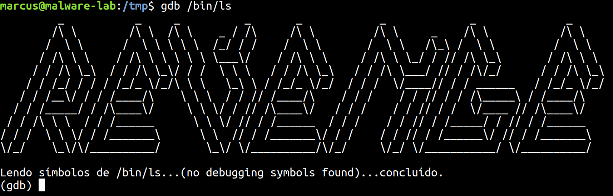
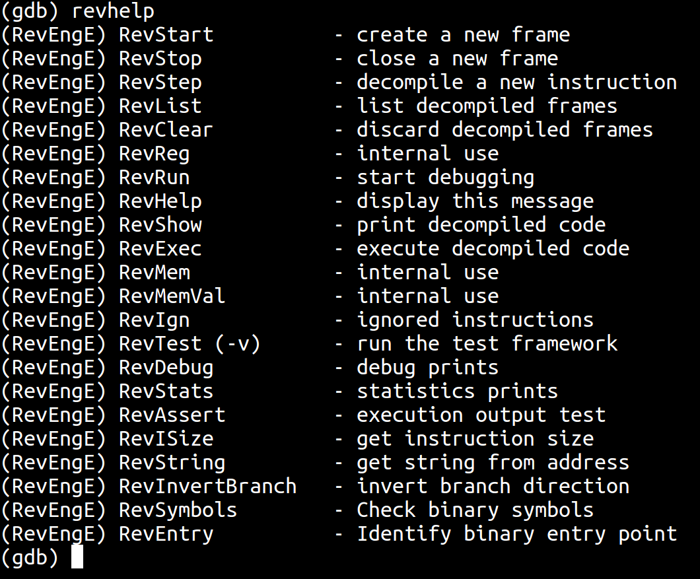
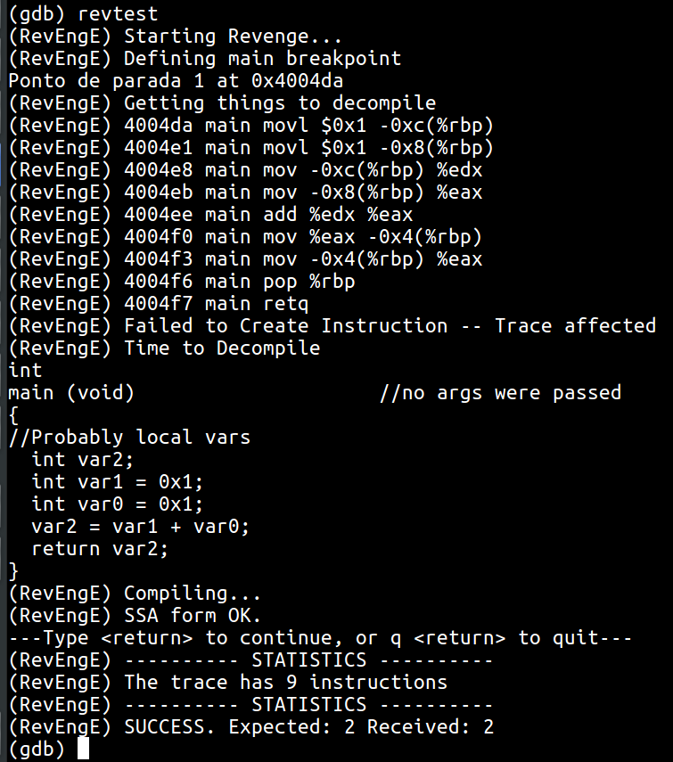

# RevEngE

Additional Material for the RevEngE (Reverse Engineering Engine) paper.

## Authors

RevEngE was developed by Marcus Botacin and Lucas Galante, under supervision of Paulo de Geus and André Grégio.

## Motivation

Explore debugging extensions and malware decompilation capabilities based on dynamic GDB debugging sessions.

## Repository Organization

* **bins**: Stores decompiled binary files.
* **sources**: Stores decompiled source files.
* **src**: Stores RevEngE's introspection routines (optional).
* **tests**: Stores RevEngE's test-case files.
* **paper**: Contains the white-paper.

## Instalation

Source your GDB: (**Notice:** It might install packages to your system!!!)

```C
source install.sh
```

Compile test files:

```C
chmod +x tests/compile_tests.sh
./tests/compile_tests.sh
```

## Basic Usage

Test functionalities:

```C
$ gdb <binary>
(gdb) revtest
```

## Usage Examples

Upon starting RevEngE, you should see this screen:



If you need help to learn new commands, just type:



You can perform a fully automated execution and decompilation analysis by typing:



## Publications

The paper *Extensões de Engenharia Reversa para o GDB* was published in the *XIX SBSEG*. [Check Here](paper/artigo.pdf)
